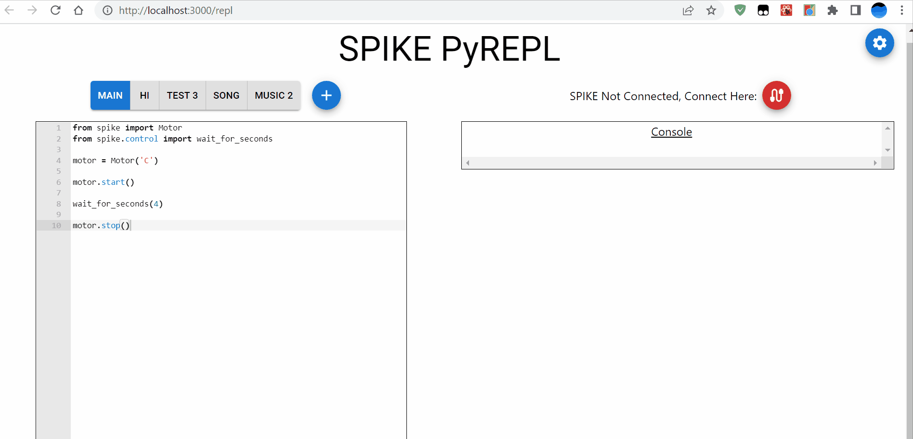

# PyREPLforSPIKE
A web-based PyREPL interface for MicroPython microprocessors

For a live demo, visit: https://pyrepl.web.app/ <br />
GitHub Pages Version: https://tuftsceeo.github.io/PyREPLforSPIKE/build/index.html

---
## Description
PyREPL for SPIKE is a web-based platform to interact with the REPL on a LEGO SPIKE Prime Hub. The application allows users to write MicroPython directly to a SPIKE Hub and log output to a live console using a graphical user interface.


---
## Using/Modifying PyREPL
### How to use PyREPL
1. Open the [PyREPL Web App](https://pyrepl.web.app/) on a supported web browser.
    * Supported browsers: Google Chrome, Microsoft Edge, Opera.
2. Connect your MicroPython device to PyREPL by clicking the red button on the upper right hand side of the window.
    * The application currently supports wire (USB) and some bluetooth connections. 
3. Write MicroPython code using the text editor on the left half of the screen.
    * [Link to SPIKE Prime Documentation](https://tufts-cr-for-lego.codingrooms.com/documentation/spike_prime_python_knowledge_base#top)
4. Run your code on the connected device using the blue play button on the upper right hand side of the window.



---
### How to modify PyREPL:
Note: PyREPL was built using [React](https://reactjs.org/)
1. Download Code
2. In a command prompt/terminal, change the working directory (cd) to the PyREPLforSPIKE directory. For example, if saved the code inside your Downloads folder, the command would be ```cd Downloads/PyREPLforSPIKE```
3. Run ```npm install```. Requires [NodeJS](https://nodejs.org/en/). Run ```npm --version``` to check if you have NodeJS installed.
4. To start the development server, run ```npm start```. You're now ready to start editing the project!
5. When you have a production ready version ready to be published run ```npm run build``` to make a static production build.


---

This project created by the Tufts Center for Engineering Education and Outreach (CEEO).

For more innovations from the Tufts CEEO, visit: https://www.ceeoinnovations.org/
